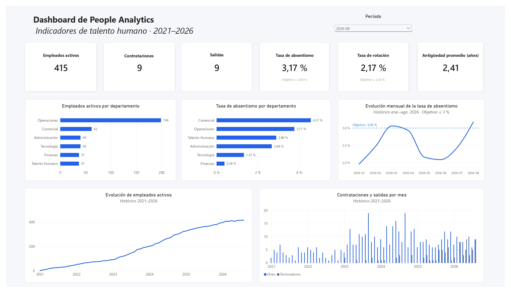
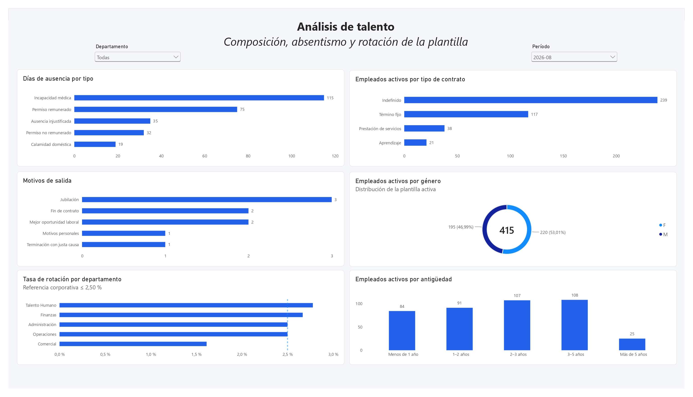

# People Analytics Dashboard \| Power BI

Proyecto práctico de **People Analytics** desarrollado en **Power BI**
para analizar indicadores relacionados con la plantilla, contratación,
rotación, absentismo y composición del talento.

> **Nota:** este es un proyecto personal y práctico de portafolio. Los
> datos utilizados son ficticios y fueron creados con fines de
> aprendizaje y demostración. No representan información de una empresa
> real.

## Dashboard

El proyecto está compuesto por dos páginas principales.

### 1. Resumen ejecutivo

Presenta una visión general de los principales indicadores de Talento
Humano:

-   Empleados activos.
-   Contrataciones.
-   Salidas.
-   Tasa de absentismo.
-   Tasa de rotación.
-   Antigüedad promedio.
-   Empleados activos por departamento.
-   Evolución mensual del absentismo.
-   Evolución histórica de empleados activos.
-   Contrataciones y salidas por mes.



### 2. Análisis de talento

Permite profundizar en la composición y comportamiento de la plantilla
mediante:

-   Días de ausencia por tipo.
-   Empleados activos por tipo de contrato.
-   Motivos de salida.
-   Distribución de empleados activos por género.
-   Tasa de rotación por departamento.
-   Distribución de empleados activos por antigüedad.
-   Filtros por departamento y período.



## Objetivo del proyecto

Construir un dashboard que permita transformar datos de empleados,
contratos, ausencias y jornadas programadas en información útil para
apoyar el análisis de Talento Humano.

El proyecto busca demostrar de forma práctica habilidades en:

-   Preparación y modelado de datos.
-   Construcción de indicadores.
-   Creación de medidas con DAX.
-   Análisis temporal.
-   Diseño de dashboards.
-   Interpretación de indicadores de People Analytics.
-   Control de calidad y consistencia de datos.

## Indicadores principales

### Empleados activos

Cantidad de empleados con contrato vigente al cierre del período
seleccionado.

### Contrataciones

Número de empleados contratados durante el período seleccionado.

### Salidas

Número de empleados cuyo contrato finalizó durante el período
seleccionado.

### Tasa de rotación

Relaciona las salidas del período con la plantilla promedio:

``` text
Tasa de rotación = Salidas / Plantilla promedio
```

Para este proyecto se utiliza como referencia corporativa:

``` text
≤ 2,50 % mensual
```

### Tasa de absentismo

Relaciona los días laborables de ausencia con los días laborables
programados:

``` text
Tasa de absentismo = Días laborables de ausencia / Días laborables programados
```

Referencia utilizada en el proyecto:

``` text
≤ 3,00 %
```

### Antigüedad promedio

Promedio de años de permanencia de los empleados activos a la fecha de
corte.

## Análisis incluidos

El dashboard permite analizar, entre otros aspectos:

-   Evolución histórica de la plantilla.
-   Comportamiento mensual de contrataciones y salidas.
-   Distribución de empleados por departamento.
-   Evolución del absentismo.
-   Departamentos con mayor tasa de absentismo.
-   Tipos de ausencia más frecuentes.
-   Motivos de salida.
-   Rotación por departamento.
-   Distribución por género.
-   Tipos de contrato.
-   Distribución de la plantilla por rangos de antigüedad.

## Ejemplo de lectura del dashboard

Para **agosto de 2026**, el dashboard muestra:

-   **415** empleados activos.
-   **9** contrataciones.
-   **9** salidas.
-   **3,17 %** de absentismo.
-   **2,17 %** de rotación.
-   **2,41 años** de antigüedad promedio.

La tasa de rotación se encuentra por debajo de la referencia corporativa
mensual del **2,50 %**.

La tasa de absentismo se encuentra **0,17 puntos porcentuales por
encima** de la referencia del **3,00 %**, lo que justificaría
profundizar el análisis por departamento, tipo de ausencia, duración y
distribución entre empleados antes de establecer causas.

El dashboard permite realizar este análisis sin asumir causalidad
únicamente a partir de los indicadores agregados.

## Modelo de datos

Principales tablas:

-   `EmployeesTable`: información general de empleados.
-   `ContractsTable`: contratos, fechas, departamentos, cargos y motivos
    de terminación.
-   `AbsencesTable`: registros de ausencias.
-   `MonthlyScheduleTable`: días laborales programados.
-   `CalendarTable`: dimensión temporal.
-   `DepartmentsTable`: dimensión de departamentos.
-   `TenureRanges`: rangos utilizados para analizar antigüedad.
-   `_Measures`: medidas DAX utilizadas en los indicadores.

El uso de dimensiones comunes permite que los filtros se propaguen de
forma consistente entre los diferentes hechos del modelo.

## Medidas DAX

Entre las principales medidas desarrolladas se encuentran:

-   Headcount.
-   Headcount al inicio del período.
-   Plantilla promedio.
-   Contrataciones.
-   Salidas.
-   Tasa de rotación.
-   Días laborables de ausencia.
-   Días laborables programados.
-   Tasa de absentismo.
-   Antigüedad promedio.
-   Empleados activos por rango de antigüedad.

La documentación detallada de las medidas se encuentra en:

``` text
docs/dax-measures.md
```

## Tecnologías utilizadas

-   **Power BI Desktop**
-   **DAX**
-   **Microsoft Excel**
-   Modelado relacional de datos
-   Git
-   GitHub

## Estructura del repositorio

``` text
people-analytics-power-bi/
│
├── README.md
│
├── dashboard/
│   └── NovaTalento_People_Analytics.pbix
│
├── data/
│   └── NovaTalento_People_Analytics_Clean.xlsx
│
├── images/
│   ├── 01-resumen-ejecutivo.jpg
│   └── 02-analisis-talento.jpg
│
└── docs/
    └── dax-measures.md
```

## Cómo ejecutar el proyecto

1.  Clonar este repositorio:

``` bash
git clone https://github.com/GermanKast/people-analytics-power-bi.git
```

2.  Abrir en **Power BI Desktop**:

``` text
dashboard/NovaTalento_People_Analytics.pbix
```

3.  Si Power BI solicita actualizar la ubicación del origen de datos,
    seleccionar:

``` text
data/NovaTalento_People_Analytics_Clean.xlsx
```

La ruta local al archivo Excel puede variar dependiendo de la ubicación
donde se clone el repositorio.

## Datos

El dataset incluido en este repositorio es **completamente ficticio** y
fue creado específicamente para este proyecto práctico.

No contiene información personal real ni datos provenientes de una
empresa.

El conjunto de datos simula información relacionada con empleados,
contratos, departamentos, cargos, fechas de contratación y terminación,
motivos de terminación, ausencias y jornadas laborales programadas.

Esto permite demostrar el proceso completo de modelado y análisis sin
exponer información confidencial.

## Aprendizajes técnicos

Durante el desarrollo del proyecto se trabajaron aspectos como:

-   Diferencia entre datos, métricas, KPIs y objetivos.
-   Importancia del denominador al construir tasas.
-   Cálculo de headcount mediante fechas de vigencia de contratos.
-   Análisis de contrataciones y terminaciones por período.
-   Uso de relaciones activas e inactivas en Power BI.
-   Propagación de filtros mediante dimensiones.
-   Construcción de medidas con contexto de filtro en DAX.
-   Análisis de absentismo utilizando días programados como denominador.
-   Análisis de rotación utilizando plantilla promedio.
-   Construcción de rangos de antigüedad.
-   Validación y reconciliación de indicadores.
-   Diseño de visualizaciones orientadas a la toma de decisiones.

## Consideraciones de interpretación

Los indicadores del dashboard describen comportamientos observados en
los datos, pero no permiten establecer por sí solos relaciones causales.

Por ejemplo, una tasa elevada de absentismo en un departamento debe
considerarse una señal para profundizar el análisis, revisando variables
como tipo de ausencia, duración, concentración por empleado y evolución
temporal.

Las referencias corporativas incluidas funcionan como umbrales de
comparación definidos para este ejercicio práctico y no deben
interpretarse como estándares universales de Recursos Humanos.

## Autor

**Germán Castañeda**

Ingeniero de Software interesado en desarrollo de software, análisis de
datos, automatización y soluciones empresariales.
